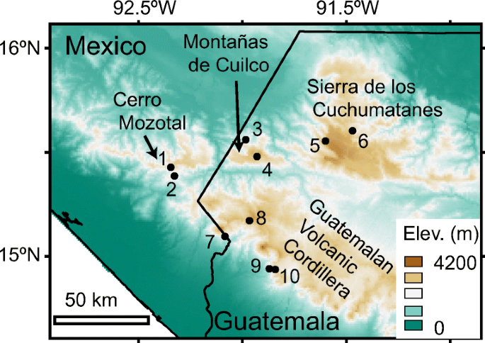

# Overview
This is a replicated microbiome analysis using only frogs, inspired by a broader amphibian study that compared salamander and frog skin microbiota. The original dataset structure was a bit messy, but it revealed some interesting patterns. I processed the data, rarefied the OTU table, and performed indicator species analysis by habitat type.

## Map of Sampling Sites

## Geographic Distribution Plot

A heatmap showing relative abundance of bacterial OTUs across frog individuals grouped by habitat. Rows represent unique OTUs; columns are individual frogs. Colors represent percent abundance after rarefaction.

# Indicator Species Analysis by Habitat
Frogs sampled from pine-oak forests exhibited a unique set of indicator bacterial taxa that were largely absent from those found in fir and cloud forests. Interestingly, fir and cloud forest frogs shared a greater proportion of microbial taxa, suggesting that environmental similarity, rather than host identity, may play a more decisive role in shaping microbiome composition across adjacent habitats.

This pattern supports previous findings that environmental filtering: through abiotic factors like temperature, moisture, and vegetation can strongly influence amphibian associated microbial communities, especially when host taxonomy is held constant

## Heatmap of OTUs

**Heatmap rows**: bacterial OTUs at species-level classification  
**Heatmap columns**: individual frogs  
**Vertical labels**: Indicator OTUs associated with each habitat type

## Bray Curtis Plot
The Bray-Curtis PCoA shows microbial community similarity across frog individuals. Clear clustering by habitat type indicates that skin microbial communities are structured more strongly by environmental factors than by individual variation among frog hosts.

## Shannon Diversity Plot
Shannon diversity varied significantly across habitats, with cloud forest frogs showing the highest within-host diversity. This may reflect a more stable or nutrient-rich environment favoring diverse bacterial assemblages.

# Discussion
Our frog-only analysis supports the broader finding from the original study: habitat is a dominant driver of skin microbiome composition in amphibians, particularly at shallow phylogenetic scales. While previous studies found evidence that host evolutionary history shapes microbiomes at higher taxonomic levels (e.g., among amphibian orders or families), our focus on a single group—frogs—allowed us to isolate habitat effects with minimal phylogenetic noise.

In this context, frogs from the same forest type (e.g., pine-oak) shared more bacterial taxa than frogs from different habitats, even though all belonged to the same general clade. These results echo prior research suggesting that microhabitat conditions (moisture, elevation, substrate, and vegetation) filter microbial colonists, shaping skin microbial communities through ecological selection rather than host-specific traits.

# Relevance to Microbiome Ecology
Environmental Filtering: The composition of amphibian skin microbiota appears tightly linked to environmental characteristics, especially in regions where host genetic differences are minimal.

## Phylogenetic Tree
The phylogenetic tree illustrates the evolutionary relationships between the frogs and their microbiomes.

- Phylogenetic Signal at Shallow Scales: Unlike in comparisons across orders (e.g., frogs vs. salamanders), we found little evidence that host species identity was a strong driver of microbial variation within frogs alone.

- Microbiome Resilience and Function: Habitat-driven differences may affect microbial resilience to pathogens such as Batrachochytrium dendrobatidis (Bd), highlighting the importance of maintaining environmental heterogeneity.

Frogs from the same habitat tended to share more OTUs than those from different habitats. The presence of unique indicator taxa suggests possible environmental filtering by microhabitat conditions like moisture, elevation, and substrate. This aligns with findings from previous amphibian microbiome studies, which showed that site and habitat can be stronger predictors of microbial community structure than host taxonomy.

# Limitations
- Environmental microbiome samples were not included, so we can’t fully assess substrate influence.
- All frogs sampled were from montane forest regions, so broader environmental conclusions are limited.
- Temporal Variation: Sampling occurred during a single season; temporal dynamics of skin microbiota remain unexplored.
- Poor Data Management, certain .csv files could be combined to increase ease of replication of data sets. 

# Conclusion
Despite the limited scope, this replication using frogs supports the original study’s findings: habitat plays a critical role in shaping amphibian skin microbiomes. Even in the absence of phylogenetic depth, clear differences in microbial community structure emerge across habitats. Changes in habitat — through deforestation or climate shifts — may result in altered microbiome composition, potentially increasing vulnerability to pathogens like *Batrachochytrium dendrobatidis* (Bd).

# Code and Data
Processed using R and Geneious.

## Frog Image

