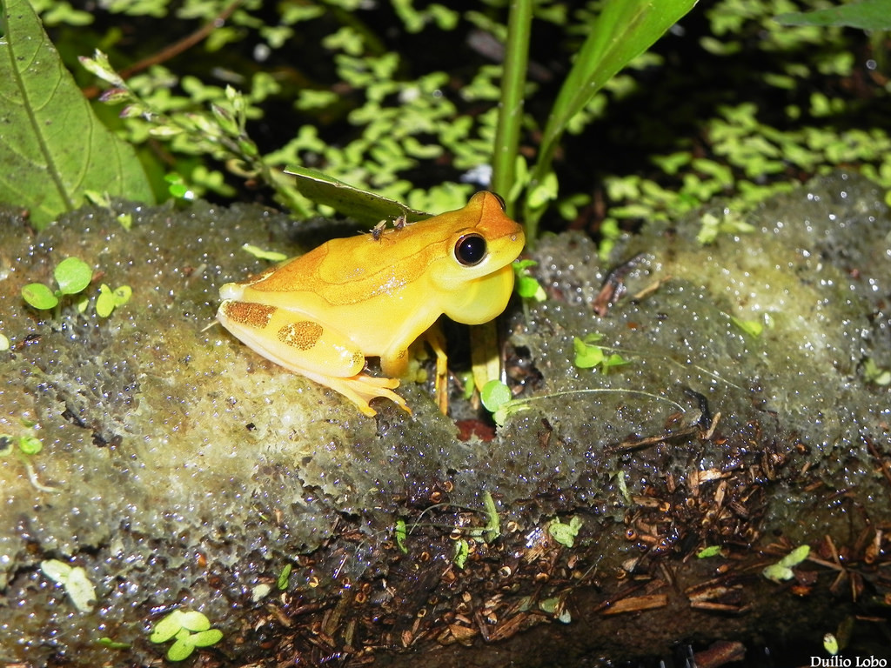

This is the final project for my R coding class at UH Manoa, focused on learning how to clean, analyze, and visualize externally provided data. The project utilizes publicly available microbiome datasets to prepare for my upcoming bioinformatics pipeline, where I will analyze the microbiomes of other organisms. 

# Project

The **NIH Human Microbiome Project (HMP)** is a groundbreaking initiative that maps the microorganisms residing on and within the human body. It has become one of the largest and most comprehensive microbiome datasets available, which is essential for understanding the role of microbial communities in human health. This includes areas such as obesity, diabetes, inflammatory bowel diseases (IBD), and other gut disorders, which are often influenced by shifts in the gut microbiota.

This project serves as an introductory analysis of 16S sequencing data and bioinformatics pipelines, providing a foundation for understanding microbiome composition and its significant implications for both health and disease. The work I’m doing builds on human microbiome data, and later, I will apply similar analytical techniques to the microbiomes of amphibians, such as salamanders and frogs, which adds another layer of ecological diversity to the analysis.

By working with both human and amphibian microbiomes, I aim to identify patterns and differences that might inform comparative studies across species, ultimately contributing to a broader understanding of how microbiomes function in different ecological niches.

# History

- **2024-04-02**: Found Human Microbiome Data from public repositories
- **2025-04-23**: Created project repository along with relevant files and raw human microbiome data for initial analysis
- **2025-05-05**: Integrated amphibian microbiome data (salamander and frog) into analysis pipeline for broader ecological comparison

- **2025-05-09**: Phylogenetic Tree Added for Host Microbiome data

# Acknowledgement

This is Brianna Correa's class project repository, based on a template cloned and modified from [https://github.com/andreashandel/dataanalysis-template](https://github.com/andreashandel/dataanalysis-template). Special thanks to the contributors and maintainers of the NIH Human Microbiome Project and other relevant datasets, whose data serve as the foundation of this work.

# Software Requirements

This template outlines the steps for a data analysis project and report writing using R, Quarto, GitHub, and a reference manager for BibTeX. For working with data analysis scripts and reports, a plain text editor is also required, as well as word-processing software (e.g., MS Word, MacOS Pages, or [LibreOffice](https://www.libreoffice.org/)) to open `.docx` files.

For more R packages supporting reproducible research, check out the task view: [Reproducible Research on CRAN](https://cran.r-project.org/web/views/ReproducibleResearch.html).

# Template Structure

- **Data Folder**: Contains the dataset(s) and any subfolders. This includes the publicly available human microbiome data as well as additional datasets from other organisms like salamanders and frogs, which are crucial for comparative analysis.
- **Code Folder**: Contains all R code scripts, including data cleaning, analysis, and visualization, along with any subfolders for organized file structure.
- **Images Folder**: Stores any graphical outputs and figures generated during analysis. This includes diversity plots, taxonomic barplots, and any other visual representations.
- **Further Modifications**: Updates to this repository will be made in the future to reflect ongoing work and data additions.

## Additional Information

As part of my bioinformatics pipeline, I will extend the analysis further by incorporating more complex datasets, which will involve the analysis of both human and non-human microbiomes. This will help to highlight the similarities and differences in microbiome compositions across species and contribute to understanding the ecological roles these microbes play in health and disease processes.

Ultimately, the goal is to develop a more nuanced understanding of how the human microbiome interacts with the body’s overall health and how we might use bioinformatics to unlock further insights into microbiome dynamics.

---

## Technical Details

This project was conducted using:

- **R** (v4.3.1 or higher)
- **Quarto** for report generation
- **dplyr**, **ggplot2**, **phyloseq**, and related packages
- Git/GitHub for version control
- RStudio for development

A complete list of package dependencies can be found in the corresponding Quarto documents.

You can explore more tools for reproducible workflows via CRAN’s [Reproducible Research Task View](https://cran.r-project.org/web/views/ReproducibleResearch.html).

---

## Acknowledgments

This project was developed by **Brianna Correa** as part of a data analysis course at UH Mānoa. The repository structure is adapted from a template developed by [Andreas Handel](https://github.com/andreashandel/dataanalysis-template). Special thanks to:

- The **NIH Human Microbiome Project** for access to baseline microbiome datasets.
- 

---

## Final Thoughts

This project represents the first step in a broader exploration of host-microbiome interactions using bioinformatics. By comparing the human gut microbiome and amphibian skin microbiomes, we begin to uncover both universal and unique features of microbial community dynamics, offering insights into health, disease, and ecology across diverse organisms.

