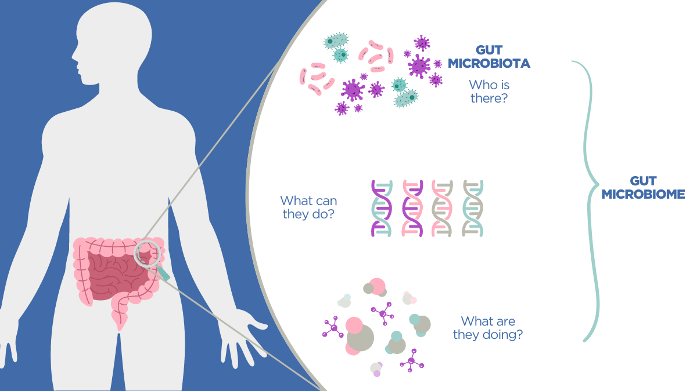

# Overview

This is the final project for my R coding class at UH Manoa focused on learning how to clean, analyze, and visualize externally provided data. This work will be done with publicly attained files to prepare me for my bioinformatics pipeline I will be completing utilizing other organisms microbiomes. The human microbiome is a well documented and known biome and will be the baseline as I attempt to recreate graphical interpretations of the data while also finding novel approaches to viewing said data. 

# Project
The NIH Human Microbiome Project (HMP) maps the microorganisms on and in the human body, creating one of the largest and most comprehensive microbiome datasets. It’s pivotal in understanding how microbial communities influence human health, particularly in areas like obesity, diabetes, and gut disorders.

This project serves as a preliminary analysis for exploring 16S sequencing data and bioinformatics pipelines, providing a foundation for understanding microbiome composition and its implications in health and disease.

# History

- **2024-04-02**: Found Human Microbiome Data 
- **2025-04-23**: Created Repo for project along with relevant files/raw human microbiome data 

### Updates:
- No updates at this time.

# Acknowledgement

This is Brianna Correa's class project repository, based on a template cloned and modified from [https://github.com/andreashandel/dataanalysis-template](https://github.com/andreashandel/dataanalysis-template).

# Software Requirements

This template lays out a data analysis project and report writing using R, Quarto, GitHub, and a reference manager for BibTeX. A plain text editor is also necessary, and word-processing software to open `.docx` files if you wish to use that format (e.g., MS Word, MacOS Pages, or [LibreOffice](https://www.libreoffice.org/)).

For more R packages supporting reproducible research, check out the task view: [Reproducible Research on CRAN](https://cran.r-project.org/web/views/ReproducibleResearch.html).

# Template Structure

- **Data Folder**: Contains the dataset and any subfolders.
- **Code Folder**: Contains all code created, including relevant subfolders.
- Further modifications can be expected in the future.

